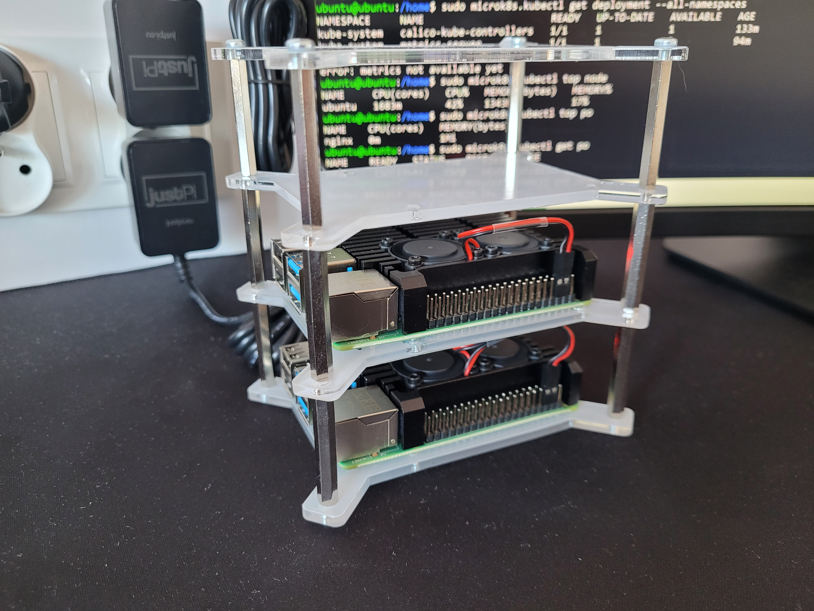
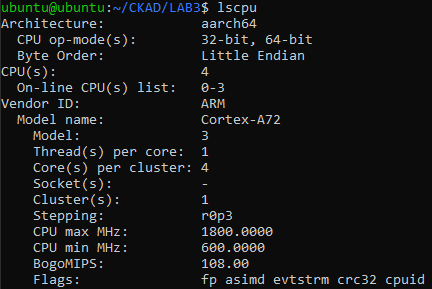
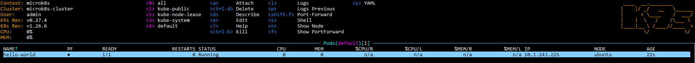

# MyK8sCluster
Hereby repository is a presentation of kubernetes cluster I built utilizing two Raspberry Pi boards

## Table of contents
* [Technologies](#technologies)
* [Pictures](#pictures)
* [Status](#status)
* [Useful links](#useful_links)
* [Inspiration](#inspiration)

## Technologies
* 2x Rasberry Pi 4
* Ubuntu 22.04.2 LTS (Jammy Jellyfish)
* K3s

## Pictures

Picture 1. Raspberry Pi boards within a rack

    

Picture 2. Output of lscpu command

    

Picture 3. k9s dashboard

## Useful links
During development I used those two examples to write terraform manifests which deploy single nginx pod and NodePort
- [https://registry.terraform.io/providers/hashicorp/kubernetes/latest/docs/resources/pod](Terraform docs)
- [https://github.com/terraform-google-modules/terraform-google-kubernetes-engine/blob/v30.2.0/examples/deploy_service/main.tf](Google exmaples)

## Status
Project is: _finished_

## Inspiration
GCE and AWS prices :P 